# HROS - Platform Workflows & Architecture

Comprehensive visual guide to HROS workflows, user journeys, and system architecture using Mermaid diagrams.

---

## 📊 System Overview

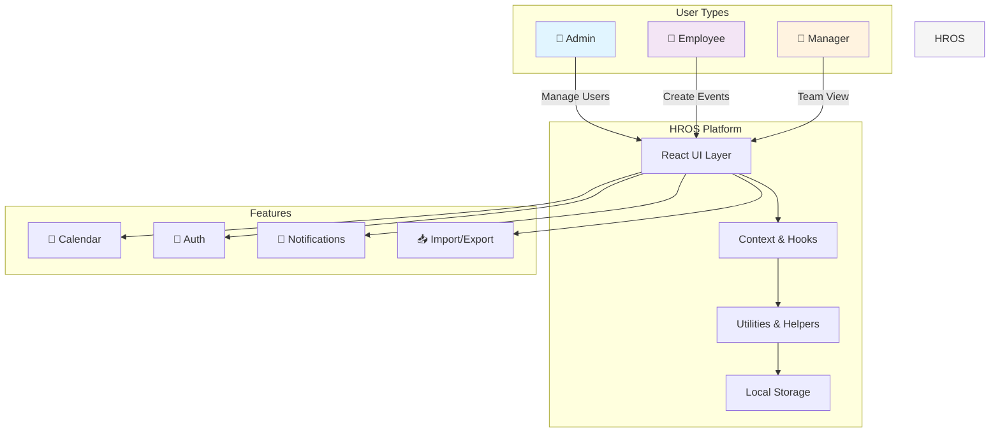

---

## 🔐 Authentication Flow

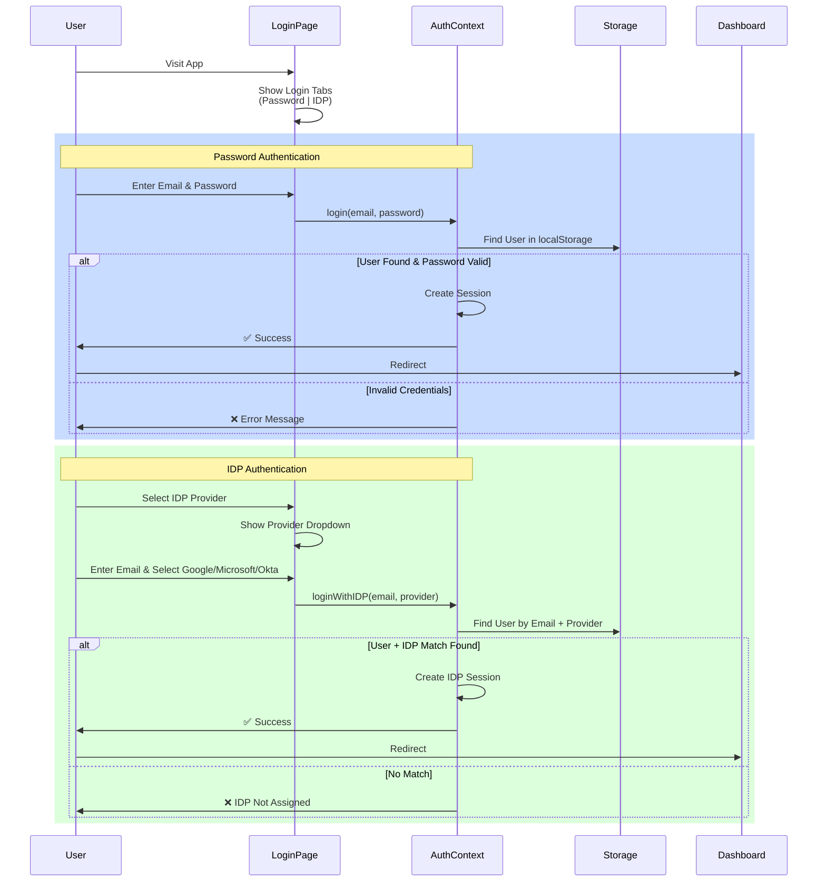

---

## 👨‍💼 Admin Workflow

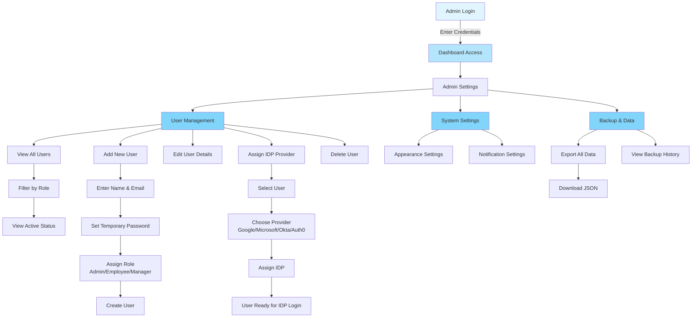

---

## 👤 Employee Workflow

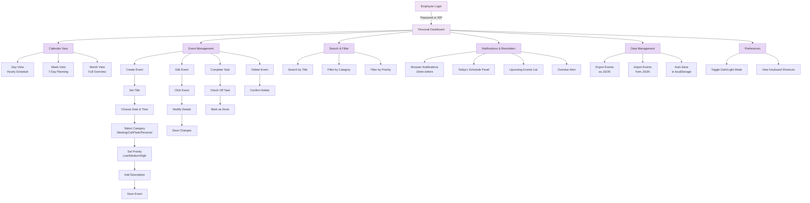

---

## 👨‍💼 Manager Workflow

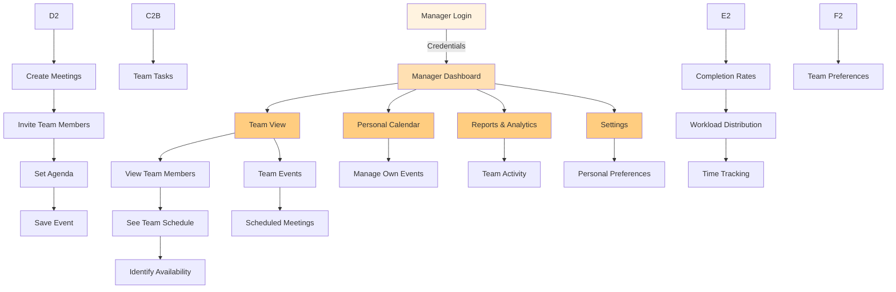

---

## 📅 Event Creation Flow

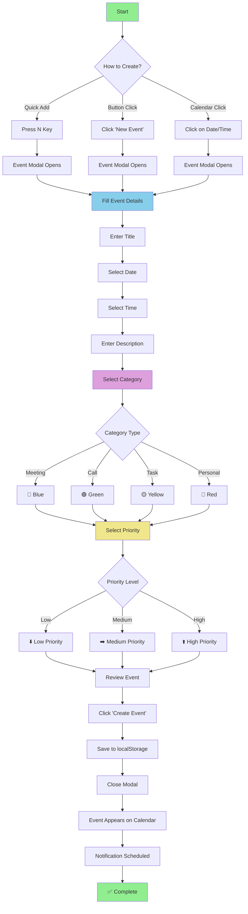

---

## 🔄 Data Flow Architecture

```mermaid
graph LR
    subgraph "User Interface"
        direction TB
        CV["Calendar Views<br/>Day/Week/Month"]
        EM["Event Modal"]
        SB["Sidebar"]
        HDR["Header"]
    end
    
    subgraph "State Management"
        direction TB
        AC["AuthContext<br/>User & Session"]
        UE["useEvents Hook<br/>Event State"]
        DM["useDarkMode Hook<br/>Theme"]
        NS["useNotifications<br/>Alerts"]
        KS["useKeyboardShortcuts<br/>Commands"]
    end
    
    subgraph "Utilities & Data"
        direction TB
        DU["dateUtils.js<br/>Date/Time"]
        EH["eventHelpers.js<br/>Event Logic"]
        ST["storage.js<br/>localStorage"]
        SD["sampleData.js<br/>Demo Data"]
        CONST["constants.js<br/>App Constants"]
    end
    
    subgraph "Persistence"
        direction TB
        LS["🗄️ Browser<br/>localStorage"]
    end
    
    CV --> UE
    EM --> UE
    SB --> AC
    HDR --> AC
    
    UE --> DU
    UE --> EH
    AC --> ST
    DM --> ST
    NS --> UE
    KS --> UE
    
    DU --> EH
    EH --> ST
    SD --> UE
    CONST --> CV
    
    ST --> LS
    
    style "User Interface" fill:#b3e5fc
    style "State Management" fill:#c8e6c9
    style "Utilities & Data" fill:#fff9c4
    style "Persistence" fill:#ffccbc
```

---

## ⌨️ Keyboard Shortcut Flow

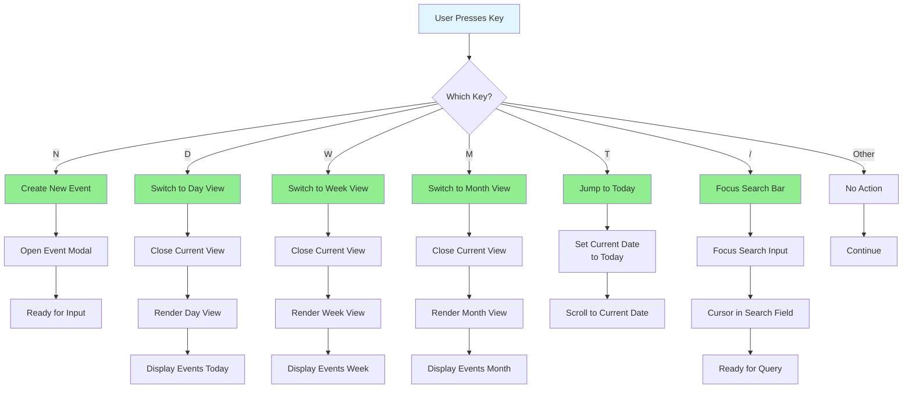

---

## 📱 View Switching Flow

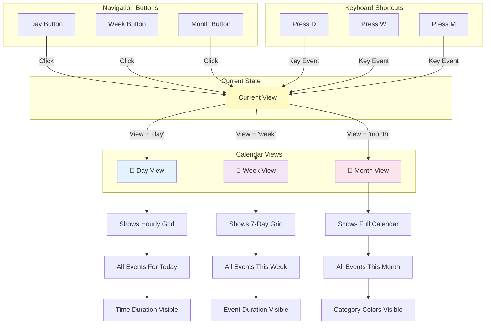

---

## 💾 Data Persistence Flow

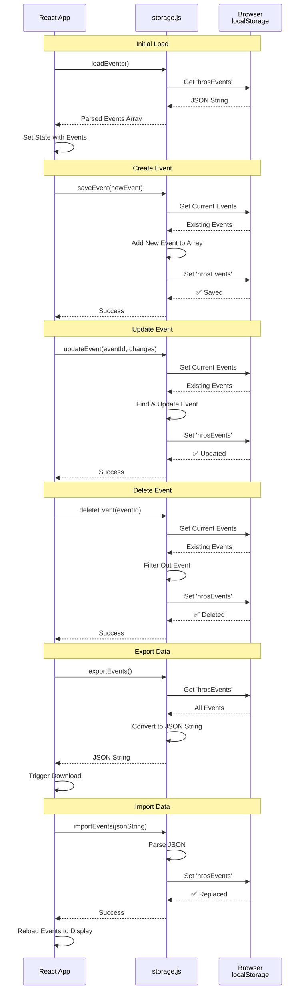

---

## 🔔 Notification & Reminder Flow

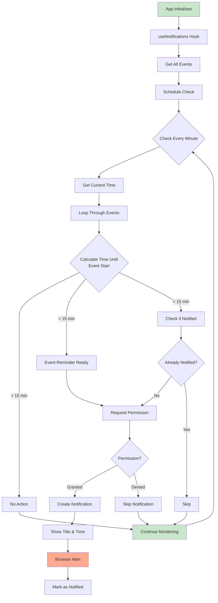

---

## 📤 Import/Export Flow

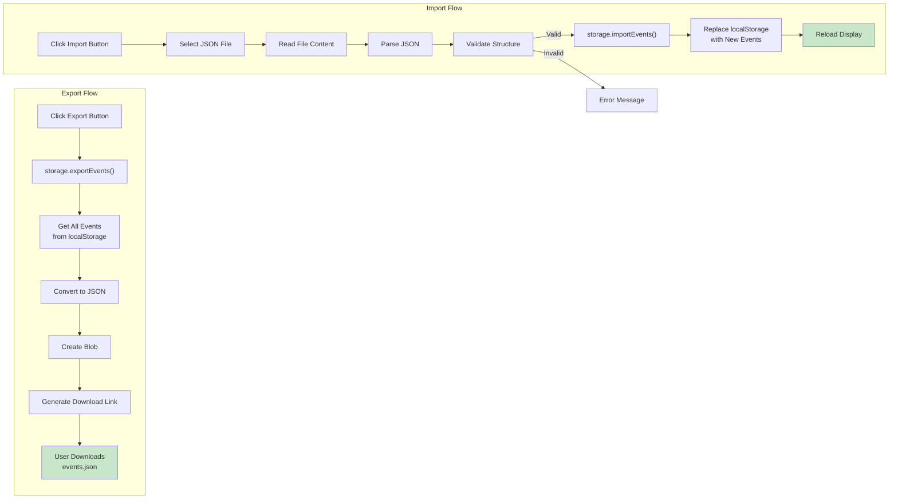

---

## 🎨 Theme Toggle Flow

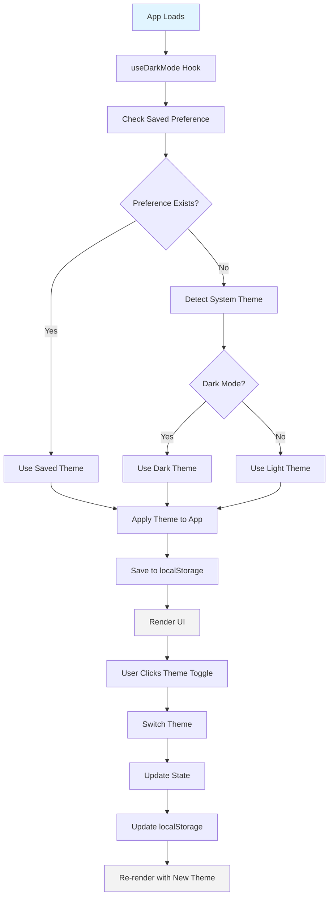

---

## 📊 Search Filter Flow

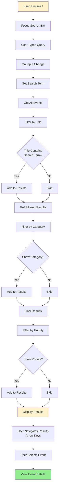

---

## 🔄 Event Edit/Delete Flow

```mermaid
graph TD
    subgraph "Edit Flow"
        E1["User Clicks Event"]
        E2["Event Details Show"]
        E2A["Modal Displays<br/>with Populated Fields"]
        E3["User Modifies Fields"]
        E4["Click 'Update Event'"]
        E5["Validate Changes"]
        E5A{Valid?}
        E6["updateEvent() Called"]
        E7["Save to localStorage"]
        E8["Reload Calendar"]
        E9["✅ Event Updated"]
    end
    
    subgraph "Delete Flow"
        D1["User Clicks Event"]
        D2["Sees Delete Option"]
        D3["Click Delete Button"]
        D4["Confirm Dialog"]
        D4A{Confirm?}
        D5["deleteEvent() Called"]
        D6["Remove from localStorage"]
        D7["Reload Calendar"]
        D8["✅ Event Deleted"]
    end
    
    E1 --> E2
    E2 --> E2A
    E2A --> E3
    E3 --> E4
    E4 --> E5
    E5 --> E5A
    E5A -->|Yes| E6
    E5A -->|No| E3
    E6 --> E7
    E7 --> E8
    E8 --> E9
    
    D1 --> D2
    D2 --> D3
    D3 --> D4
    D4 --> D4A
    D4A -->|Yes| D5
    D4A -->|No| D1
    D5 --> D6
    D6 --> D7
    D7 --> D8
    
    style E9 fill:#90ee90
    style D8 fill:#90ee90
```

---

## 🏗️ Component Architecture

```mermaid
graph TB
    subgraph "Layout"
        APP["App.jsx<br/>Route Handler"]
        APP --> LP["LoginPage"]
        APP --> PR["ProtectedRoute"]
        PR --> HROS["HROSDashboard<br/>Main Container"]
    end
    
    subgraph "Navigation & UI"
        HROS --> HDR["Header.jsx"]
        HROS --> SB["Sidebar.jsx"]
        HDR --> HDRC["Theme Toggle<br/>User Menu"]
        SB --> SBITEM["Navigation Items<br/>Board Links"]
    end
    
    subgraph "Calendar Views"
        HROS --> VIEWS["Calendar Views"]
        VIEWS --> DV["DayView.jsx"]
        VIEWS --> WV["WeekView.jsx"]
        VIEWS --> MV["MonthView.jsx"]
    end
    
    subgraph "Boards & Features"
        HROS --> BOARDS["Specialized Boards"]
        BOARDS --> AB["ActionItemsBoard"]
        BOARDS --> EB["ExitsBoard"]
        BOARDS --> OB["OnboardingBoard"]
        BOARDS --> HPB["HiringPipelineBoard"]
        BOARDS --> OOB["OneOnOneBoard"]
        BOARDS --> PB["ProjectHealthBoard"]
        BOARDS --> RB["ReportsBoard"]
        BOARDS --> TPB["TeamPulseBoard"]
    end
    
    subgraph "Modals & Forms"
        HROS --> MODALS["Modals"]
        MODALS --> EM["EventModal.jsx"]
        MODALS --> HF["HiringForm.jsx"]
        MODALS --> OOF["OneOnOneForm.jsx"]
    end
    
    subgraph "Alerts & Displays"
        HROS --> ALERTS["Alerts & Displays"]
        ALERTS --> RFA["RedFlagAlert.jsx"]
        ALERTS --> EC["EventCard.jsx"]
        ALERTS --> TS["TodaySchedule.jsx"]
    end
    
    subgraph "Admin Features"
        HROS --> ADMIN["Admin Features"]
        ADMIN --> AS["AdminSettings.jsx"]
        ADMIN --> BS["BackupSettings.jsx"]
    end
    
    subgraph "Analytics"
        HROS --> ANALYTICS["Analytics"]
        ANALYTICS --> MD["MetricsDashboard.jsx"]
        ANALYTICS --> DWB["DailyWorkBoard.jsx"]
    end
    
    style APP fill:#bbdefb
    style HROS fill:#c8e6c9
    style VIEWS fill:#fff9c4
    style BOARDS fill:#ffccbc
    style MODALS fill:#f0f4c3
    style ALERTS fill:#dcedc8
    style ADMIN fill:#ffccbc
    style ANALYTICS fill:#c8e6c9
```

---

## 📱 Mobile/Responsive Layout

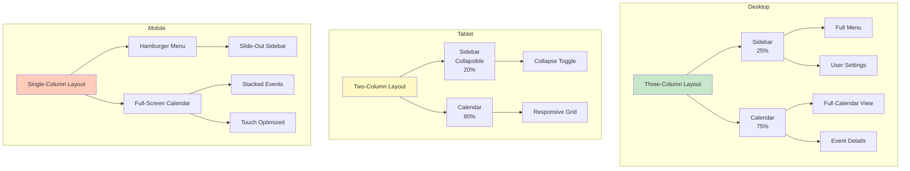

---

## 🔐 IDP Assignment System Flow

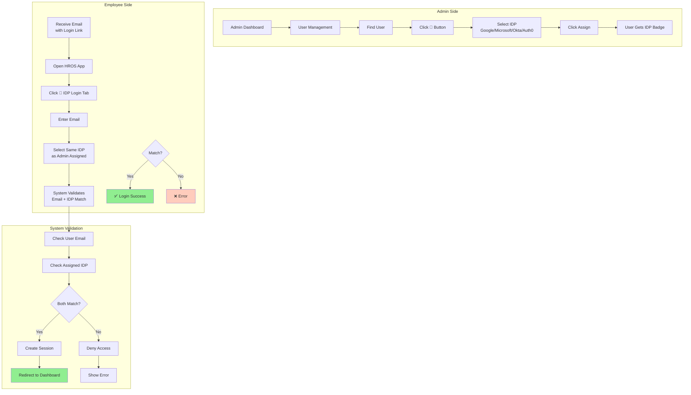

---

## 📈 Complete User Journey (End-to-End)

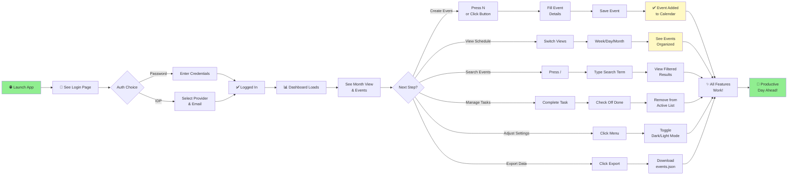

---

## 📋 Legend & Status

| Element | Meaning |
|---------|---------|
| 🔵 Blue Box | User Interface |
| 🟢 Green Box | Success/Complete |
| 🟡 Yellow Box | Processing/Current |
| 🔴 Red Box | Error/Alert |
| 🟣 Purple Box | Data/State |
| 🟠 Orange Box | Admin Functions |

---

**Last Updated**: April 2026  
**Version**: 1.0.0  
**Status**: Complete ✅
